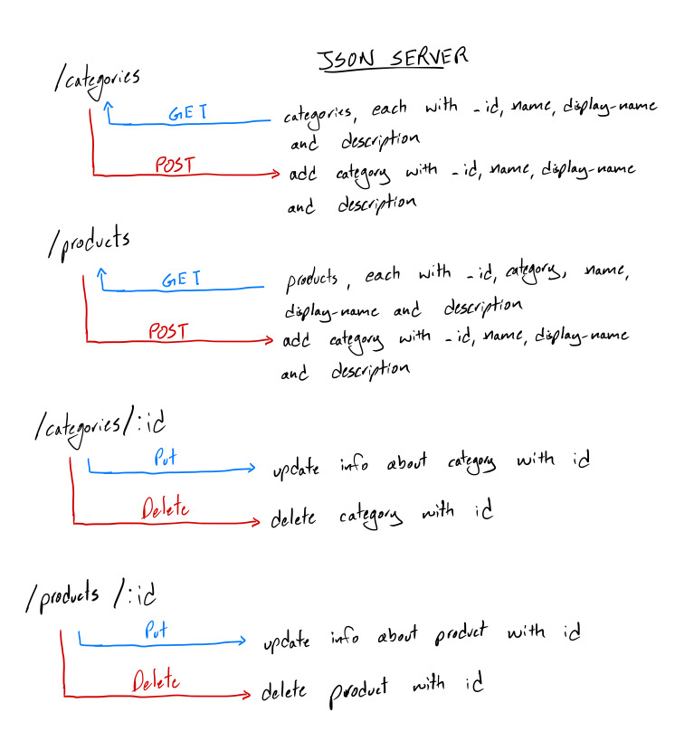

# LAB - 06

## Simple API

### Author: Jagdeep Singh

A simple API for a storefront selling wacky food. Built using a single JSON file and running JSON server.

### Links and Resources
* [submission PR](https://github.com/401-advanced-javascript-js/lab-06-simple-api/pull/1)

#### Documentation
* [API docs](https://app.swaggerhub.com/apis-docs/JagdeepSing/Simple-API/0.1#/)

#### Running the app

In terminal, run the following commands:
* `npm i json-server`
* `json-server data/db.json --watch=./data/db.json -i=_id`

A message should be outputed with a localhost address where the API can be accessed. Refer to the docs to view how the API can be used.

Visit the following, [React API Client](https://codesandbox.io/s/api-client-s45o4), and fork the repo. Open the .env file and enter the URL for your API server.

#### UML

